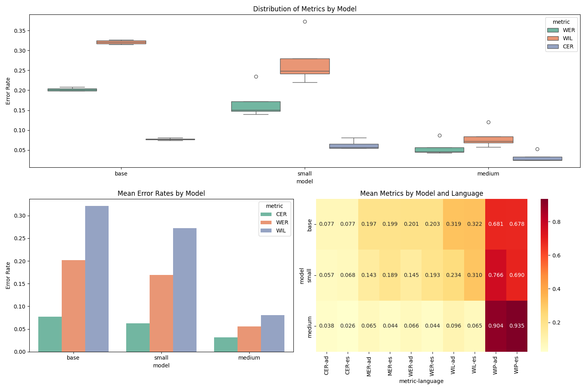

1. A box plot showing the distribution of metrics (WER, WIL, CER) across models, which helps visualize:
   - The median performance
   - The spread of the data
   - Any outliers

2. A bar plot showing mean metrics with error bars, which shows:
   - Average performance for each model
   - The variability in performance through error bars
   - Easy side-by-side comparison between models

3. A heatmap showing mean metrics by model and language, which helps visualize:
   - Performance differences between languages
   - All metrics at once in a compact format
   - Patterns across models and languages

| Metric | Range  | Better Value | Measures                | Name                       |
| ------ | ------ | ------------ | ----------------------- | -------------------------- |
| WER    | 0 to ∞ | Lower        | Word edit distance      | Word Error Rate            |
| CER    | 0 to ∞ | Lower        | Character edit distance | Character Error Rate       |
| MER    | 0 to 1 | Lower        | Word boundary matches   | Match Error Rate           |
| WIL    | 0 to 1 | Lower        | Information loss        | Word Information Loss      |
| WIP    | 0 to 1 | Higher       | Information preserved   | Word Information Preserved |

Conclusiones:

1. El medium anda mejor. Esperable, siguen el orden de tamano del modelo base, small, medium.

1. Error Rates:
- WIP anda en el 90% para el modelo medium, la transcripcion captura bien el contenido semantico. relacionado con lo de las comas seguramente
- WER anda alrededor del ~5% para medium, mientras que el ~20% para el base.
- CER generalmente es mas bajo que el WER, es mas propenso a errarle a errores de caracter que a palabras completas? sera por las comas?

1. Modo idiomas:
- Del heatmap, si bien no hay tanta diferencia setear el parametro lenguaje en espanol parece que es buena idea. todas las metricas son un poquito mejor.

1. Consistencia:
- Del boxplot se puede ver que si bien hay outliers generalmente el modelo es bastante consistente. (cajas chiquitas)

Conclusion de las Conclusiones:
- Usar el modelo medium, preferiblemente seteando el lenguaje en espanol. No es tan lento y es algo que se hace una vez por clase (no algo rutinario). Logra mejores transcripciones.

| Size   | Parameters | English-only model | Multilingual model | Required VRAM | Relative speed |
| ------ | ---------- | ------------------ | ------------------ | ------------- | -------------- |
| tiny   | 39 M       | tiny.en            | tiny               | ~1 GB         | ~10x           |
| base   | 74 M       | base.en            | base               | ~1 GB         | ~7x            |
| small  | 244 M      | small.en           | small              | ~2 GB         | ~4x            |
| medium | 769 M      | medium.en          | medium             | ~5 GB         | ~2x            |
| large  | 1550 M     | N/A                | large              | ~10 GB        | 1x             |
| turbo  | 809 M      | N/A                | turbo              | ~6 GB         | ~8x            |
[openai/whisper: Models](https://github.com/openai/whisper?tab=readme-ov-file#available-models-and-languages)