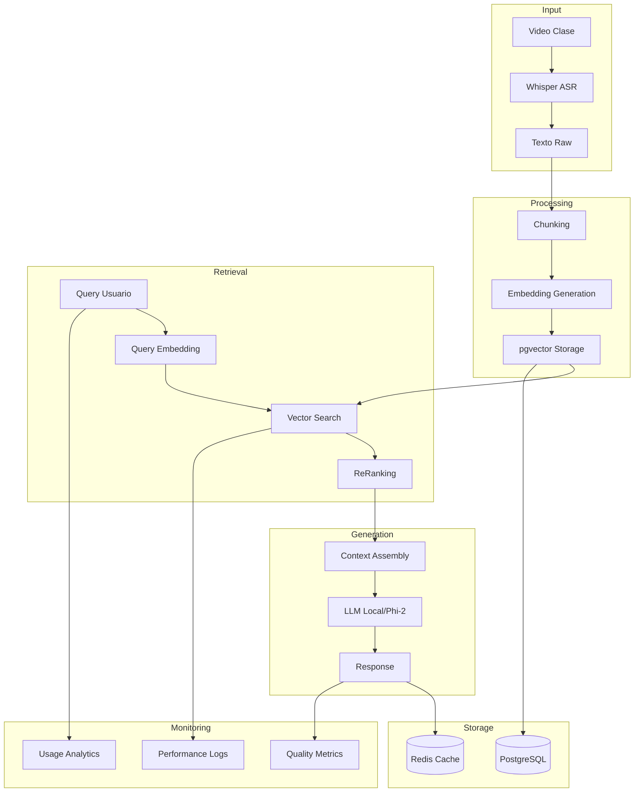

Excelentes preguntas. Vamos a profundizar en cada aspecto:

### Bases de Datos Vectoriales

1. **pgvector vs alternativas**
- pgvector es definitivamente production-ready y tiene varias ventajas:
  - Integración nativa con PostgreSQL (si ya usas Postgres)
  - Sin necesidad de mantener servicios adicionales
  - Costos más predecibles (no hay pricing por volumen)
  - Transaccionalidad con el resto de tus datos
  - Buen rendimiento hasta ~10M vectores

- Limitaciones de pgvector:
  - Performance puede degradarse con datasets muy grandes
  - Las búsquedas son más lentas que alternatives especializadas
  - Menos features especializados (ej: filtrado metadata eficiente)

2. **¿Por qué Chroma en dev y Pinecone en prod?**
Esta fue una recomendación conservadora, pero podemos matizarla:

- **Chroma**:
  - Excelente para desarrollo por su simplicidad
  - Fácil setup local sin infraestructura
  - Gratis y open source
  - Buena integración con LangChain

- **Pinecone**:
  - Servicio managed (menos overhead operacional)
  - Muy buena escalabilidad
  - Features avanzados (metadata filtering, namespaces)
  - Pero: Costoso para proyectos académicos

**Recomendación actualizada**: 
Para tu caso específico, pgvector podría ser la mejor opción porque:
1. Es open source
2. Se integra bien con el stack académico
3. El volumen de datos de clases probablemente no llegue a sus límites
4. Reduces la complejidad operacional

### PostgreSQL y Redis

**PostgreSQL** se usaría para:
1. Almacenar metadata de documentos/videos
2. Gestionar usuarios y permisos
3. Logs y analytics
4. Los embeddings (via pgvector)
5. Cache de largo plazo

**Redis** se usaría para:
1. Rate limiting
2. Cache de sesiones
3. Cache de resultados frecuentes
4. Colas de procesamiento (transcripción)
5. Cache de corto plazo para respuestas

Pero si quieres simplificar, podrías empezar solo con PostgreSQL y pgvector.

### LLMs Open Source

Hay varias opciones viables dependiendo de tus recursos:

1. **Mistral 7B**
- Excelente balance rendimiento/recursos
- ~16GB VRAM para inferencia
- Muy buena calidad de respuestas
- Tiene versiones optimizadas (llamadas "mixtures")

2. **Llama-2 7B**
- Similar requerimientos a Mistral
- Bien documentado
- Gran comunidad
- Buenos fine-tunes disponibles

3. **Phi-2 (2.7B)**
- Muy eficiente (4-8GB VRAM)
- Sorprendentemente capaz para su tamaño
- Ideal para recursos limitados
- Microsoft lo optimizó específicamente para casos académicos

4. **Tinyllama (1.1B)**
- Ultrapequeno (2-4GB VRAM)
- Calidad decente para Q&A simple
- No tan bueno para generación compleja

**Recomendación para tu caso**:
1. Empezaría con Phi-2 o Mistral 7B
2. Usar quantización para reducir requerimientos
3. Considerar vllm o text-generation-inference para inferencia eficiente
4. Si los recursos son muy limitados, TinyLlama podría funcionar

Algunas consideraciones adicionales para el RAG:

1. **Chunking Strategy**
   - Para contenido educativo, chunks por concepto/tema
   - Overlap para mantener contexto
   - Metadata rica (timestamp, tema, clase)

2. **Retrieval**
   - Hybrid search (semántico + keyword)
   - Parent-child chunks para contexto
   - Reranking basado en relevancia y coherencia

3. **Optimizaciones**
   - Batch processing para embeddings
   - Cache de queries frecuentes
   - Compresión de embeddings

¿Te gustaría que profundice en algún aspecto específico de estos componentes?